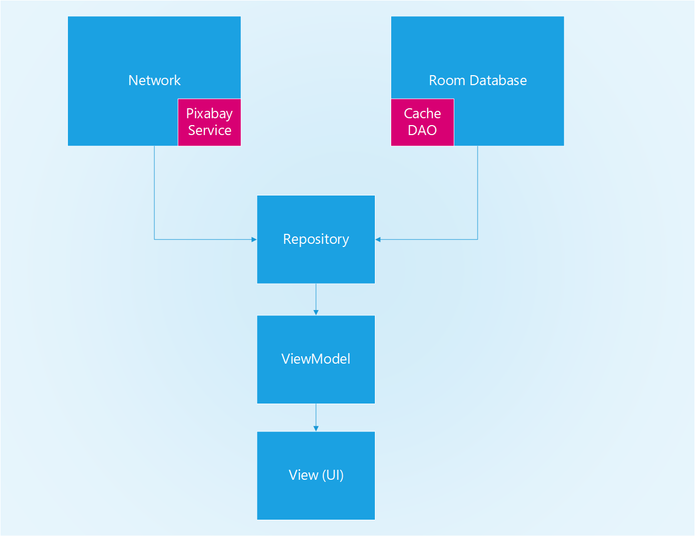

# PixaClient

An android client for Pixabay API

## Overview

A small project to work as a client for pixabay.com services. you can test the application yourself using the releases tab in this project.

## Architecture

The application is an MVVM module based architecture. it uses the following architecture:

## Tests

We have 4 kinds of tests in this application:

1. JUnit 4 and Roboelectric tests, these cover all the business logic device independent classes. in our case these are the network module, View Model classes and repositories. these are located under `unit` folder in the test source set.
2. BDD Integration Test: These cover the process of getting and retrieving data from the Backend. the feature is located under `src/assets/features` and the implementation is inside `cucumber` located under `unit` folder in the test source set.
3. Instrumentation AndroidJUnit tests. these are for the DAO of the project, located under `unit` in the `androidTest` source set.
4. E2E tests, while espresso is not the optimal solution, the app is simple enough to use it here. these are located under `e2e` inside the `androidTest` source set.

